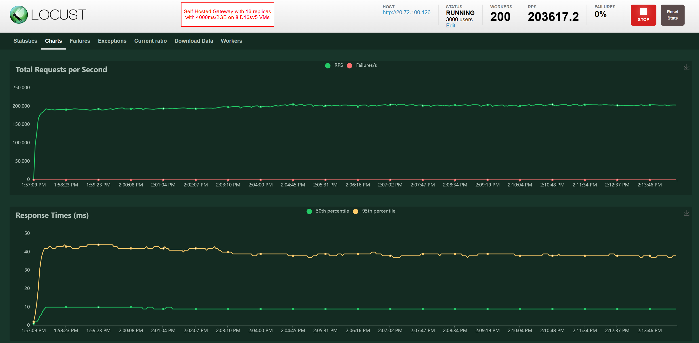

# Azure API Management Self-Hosted Gateway Test

## AKS

```bash
az group create --name rg-apim1 --location eastus2

az network vnet create --resource-group rg-apim1 --name vnet-apim1 --address-prefixes 10.0.0.0/16
az network vnet subnet create --resource-group rg-apim1 --name aks-subnet --vnet-name vnet-apim1 --address-prefixes 10.0.0.0/20

az aks create --resource-group rg-apim1 --name aksapim --network-plugin kubenet --node-vm-size Standard_D16ads_v5 --node-count 20 --vnet-subnet-id /subscriptions/c9c8ae57-acdb-48a9-99f8-d57704f18dee/resourceGroups/rg-apim1/providers/Microsoft.Network/virtualNetworks/vnet-apim1/subnets/aks-subnet --service-cidr 10.200.0.0/16 --dns-service-ip 10.200.0.100 --enable-azure-monitor-metrics --node-osdisk-type Ephemeral

az aks nodepool add --resource-group rg-apim1 --cluster-name aksapim --name backend --node-count 2 --node-vm-size Standard_D16s_v5 --vnet-subnet-id /subscriptions/c9c8ae57-acdb-48a9-99f8-d57704f18dee/resourceGroups/rg-apim1/providers/Microsoft.Network/virtualNetworks/vnet-apim1/subnets/aks-subnet --node-osdisk-type Managed

az aks get-credentials --resource-group rg-apim1 --name aksapim

kubectl config use-context aksapim
```

## Create backend API

```bash
kubectl apply -f nginx-backend.yaml
kubectl get pods -o wide -n nginx-backend
kubectl get services -n nginx-backend

curl http://20.75.116.218/
```

## APIM

```bash
# Create APIM
az apim create --name apipmshgperf1c --resource-group rg-apim1 --publisher-email test@example.com --publisher-name TestAPIM --sku-name Premium --location eastus2

# Provision Self-Hosted Gateway https://learn.microsoft.com/en-us/azure/api-management/api-management-howto-provision-self-hosted-gateway
# https://learn.microsoft.com/en-us/azure/api-management/how-to-self-hosted-gateway-on-kubernetes-in-production

kubectl create secret generic shg2-token --from-literal=value="GatewayKey ..."  --type=Opaque
# Configure proper nodeSelector for gateway to not be on the backend pool
kubectl apply -f shg2.yaml

# Use Azure Portal to configure APIM APIs with names like "nginxbackend" and "nginxbackend-clusterip" and URL pointing to either the load balancer or the cluster IP of the nginx backend service
```

## Self-Hosted Gateway

```bash
kubectl get nodes
kubectl get pods -o wide
kubectl get deployments
kubectl get services -A

curl http://20.85.49.222/nginxbackend
curl http://20.85.49.222/nginxbackend-clusterip
```

## Execute command from node

```bash
kubectl get nodes -o wide
kubectl debug node/aks-nodepool1-36145279-vmss00000m -it --image=jrecord/nettools --profile=netadmin
kubectl debug node/aks-nodepool1-36145279-vmss00000p -it --image=ubuntu --profile=netadmin
curl http://20.22.43.28/echo/resource
```

## Execute command from pod

```bash
kubectl run nettools --image=jrecord/nettools -it -- /bin/bash
curl http://20.22.43.28/echo/resource -v
```

## Send traffic

* [Locust example](./locust/)

## Examples



## Network observability

```bash
az feature register --namespace "Microsoft.ContainerService" --name "NetworkObservabilityPreview"
az aks update -g rg-apim1 -n aksapim --enable-network-observability
az aks update -g rg-apim1 -n aksapim --disable-network-observability
```

## Conntrack Test

```bash
# https://technology.lastminute.com/chasing-k8s-connection-reset-issue/
kubectl apply -f conntrack-ds.yaml

sysctl net.netfilter.nf_conntrack_tcp_be_liberal
```
